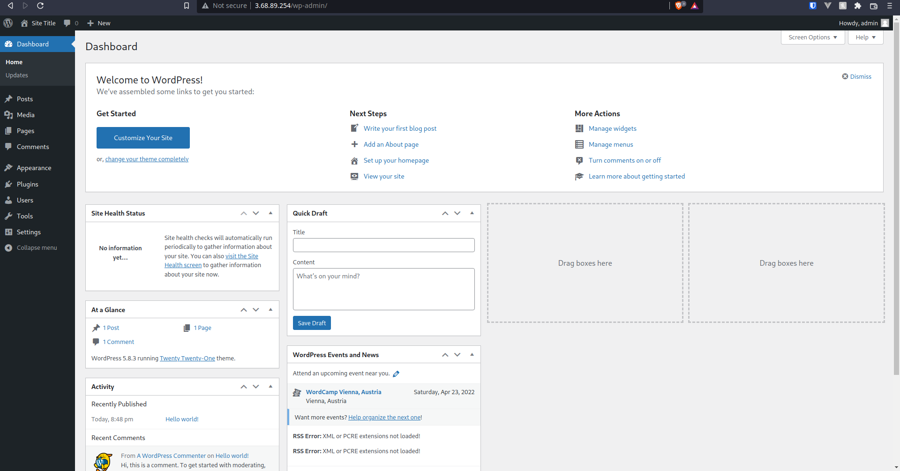

# Automatic Wordpress installation with Ansible

To deploy run
```
ansible-playbook -i hosts.ini setup_wp.yaml
```

## How it works
### os_packages.yaml
* Install EPEL repository
* Install Remi's Repo
* Install MariaDB repo
* Install httpd (Apache server)
* Install MariaDB
* Install php

### db_related.yaml
* Start mariadb service
* Create database
* Create database user

### wp_related.yaml
* Download Wordpress
* Install Wordpress in Apache's website directory
* Copy site config
* Copy Wordpress config
* Start httpd service

## Proof that it works

